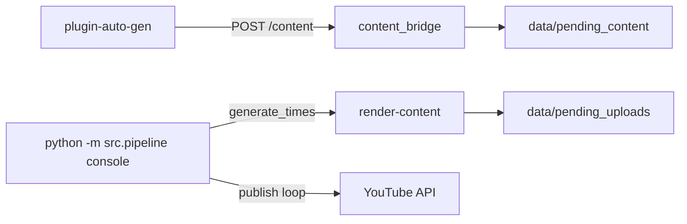

# auto-marketing-images

Pipeline de YouTube Shorts da **RPJ Tech Group** (`rpjtechgroup`): conteúdo via plugin ChatGPT **ou** roteiro Gemini legado → vídeo com TTS + hyper-edit → upload YouTube API.

## Fluxo integrado (recomendado)

1. **Plugin** (`plugin-auto-gen/`): gera roteiro + imagens no ChatGPT e envia ao bridge.
2. **Console** (`python -m src.pipeline console`): nos horários do canal (`generate_times`), renderiza o pacote mais antigo da fila e enfileira o vídeo.
3. **Publicação**: loop contínuo envia vídeos via OAuth YouTube.

Configuração: `content.source: plugin` no YAML do canal e `content_bridge` em `config/pipeline.yaml`.

## Início rápido

1. Copie `config/env.example` → `.env` ou `config/.env` e preencha as chaves.
2. Copie `config/channels_config_structure/rpjtechgroup.yaml.example` → `rpjtechgroup.yaml` (se ainda não existir).
3. OAuth YouTube: `config/secrets/rpjtechgroup_client_secret.json` + `python -m src.pipeline oauth-reauth --channel rpjtechgroup`
4. Console (produção): `python -m src.pipeline console`
5. Carregue a extensão em `plugin-auto-gen/` e configure URL do bridge + canal.

## Comandos úteis

| Comando | Descrição |
|---------|-----------|
| `python -m src.pipeline console` | Console infinito (bridge + render + publish) |
| `python -m src.pipeline render-content --channel rpjtechgroup` | Render manual do pacote mais antigo |
| `python -m src.pipeline publish` | Publica o vídeo mais antigo da fila |
| `python -m src.pipeline generate --channel rpjtechgroup` | Modo legado Gemini (canal com `content.source: gemini`) |

## Documentação

- Pacote plugin → console: [`docs/content-package-schema.md`](docs/content-package-schema.md)
- Chaves de API: [`config/env.example`](config/env.example)
- Plugin: [`../plugin-auto-gen/README.md`](../plugin-auto-gen/README.md)
- Deploy VM: [`docs/deploy-oci-vm.md`](docs/deploy-oci-vm.md)
